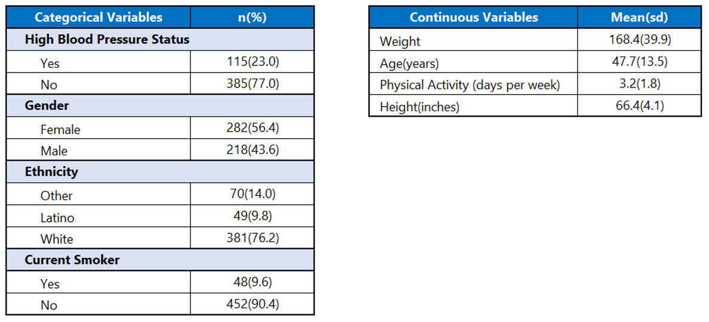
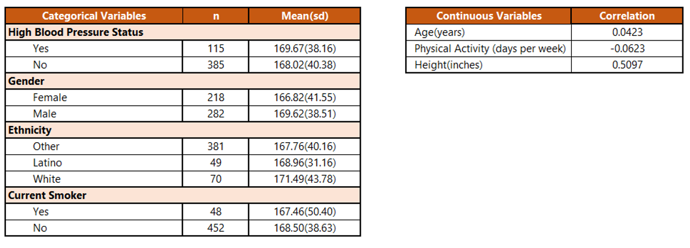
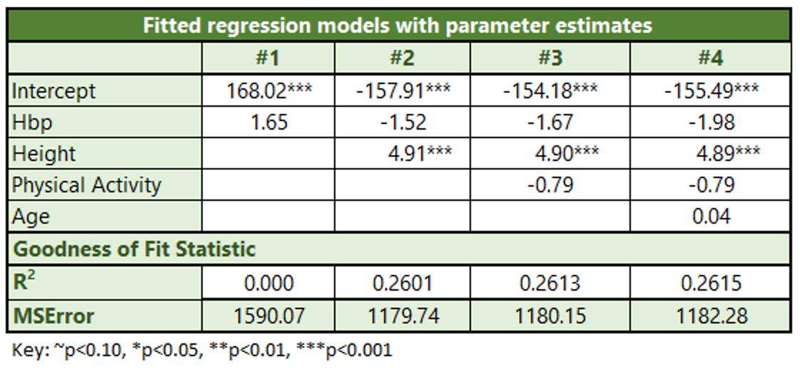
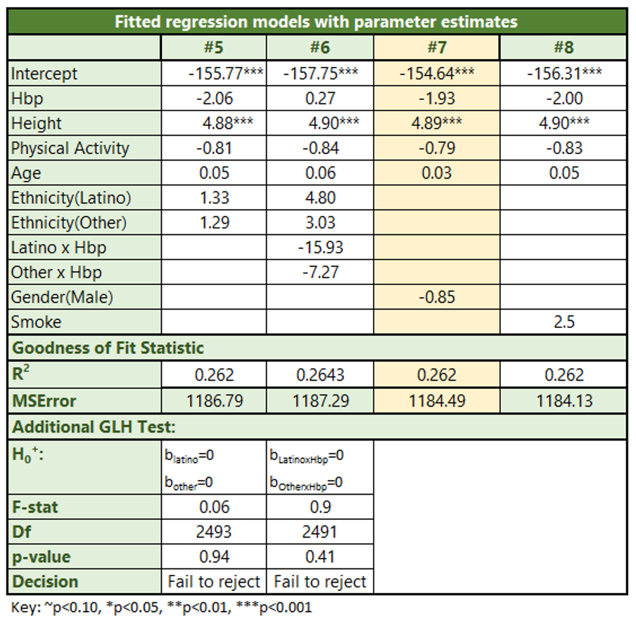
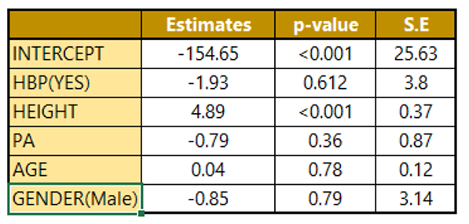
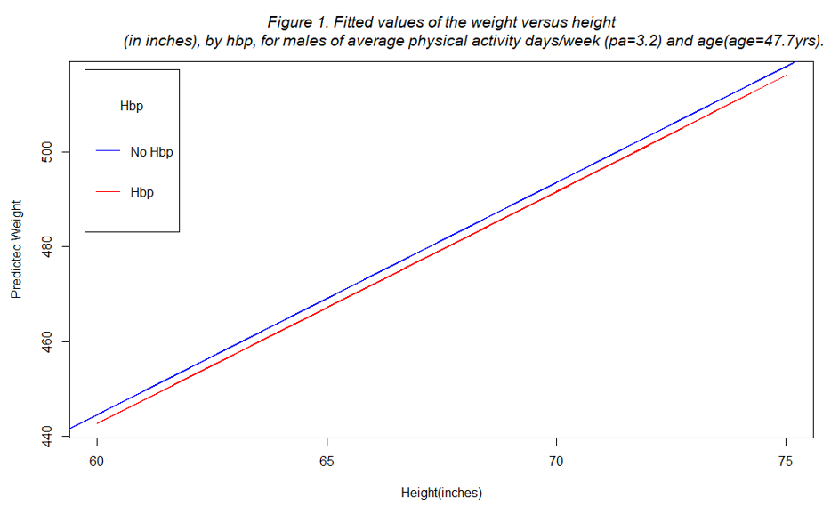

# Exploring the Relationship between High Blood Pressure and Weight: A Linear Regression Analysis

This data analysis investigates the association between weight and high blood pressure using linear regression. Derived from the California Health Interview Survey (CHIS) 2009, the dataset comprises 500 individuals and includes variables such as blood pressure, height, age, gender, smoking habits, physical activity, and ethnicity. The main question is whether weight differs between individuals with and without high blood pressure

#### **Data Management**
The analysis starts with reading the data and converting variables like high blood pressure, gender, smoking habits, and ethnicity into factors with labels. Descriptive statistics are then used to understand variable distributions.

#### **Bivariate Analysis**
Bivariate analyses are conducted to explore the unadjusted relationships between weight and factors like high blood pressure, smoking, gender, ethnicity, age, and physical activity. examining the mean weight across categories of categorical variables and evaluating correlations with continuous variables. Single linear regression models are employed for this purpose.

#### **Model Building**
The next step involves constructing multiple linear regression models with different combinations of variables significantly associated with weight. A forward stepwise regression procedure is used to develop a final model that predicts weight while considering high blood pressure and other relevant factors. The change-in-estimate criterion, with a 10% cutoff, is applied to assess potential confounding by examining alterations in adjusted parameter estimates.

#### **GLH Test**
Additional general linear hypothesis tests were performed to evaluate the statistical significance of the conceptual group of predictors.

## Tables and Findings

#### Univariate Descriptive Analysis of the Survey Population (n=500)



#### Bivariate Analysis of Associations between High Blood Pressure Status, and Other Predictor Variables with Weight in the Survey Population (n=500)



#### Bivariate Analysis
The average weight for individuals with high blood pressure is 169.67 pounds, whereas those without high blood pressure have a mean weight of 168.02 pounds. The overall sample mean weight is 168.4 pounds. This indicates that there is a minimal disparity in mean weight between individuals with and without high blood pressure, as both groups exhibit similar average weights. Regarding other categorical variables, there are no statistically significant variations in mean weight between males and females, as well as between current smokers and non-smokers. However, in the case of ethnicity, the mean weight for individuals in the "other" category (including PACIFIC ISLANDER, AMERICAN INDIAN, ASIAN, and AFRICAN AMERICAN) appears to differ from the mean weights of White and Latino individuals. For continuous variables the correlation between age and weight is 0.04, which falls below 0.3, indicating a small linear relationship between the two variables. On the other hand, the bivariate correlation between weight and height shows a moderately significant positive linear relationship. In the case of physical activity, there is a small negative linear relationship with weight.
After generating dummy variables for categorical variables (ethnicity, gender, smoke), we examined all potential bivariate correlations among the predictors to assess independence. There are only minor correlations between continuous variables such as height, age, and physical activity, meeting the assumption for independent predictors. Similarly, there are only marginal relationships between categorical variables and between categorical and continuous variables, satisfying the assumption of independence among predictors.

#### Modeling the relationship between Weight and Predictor variables





#### Linear Regression Model Building

In Model M1, HBP is designated as a high-priority variable and is consistently retained in subsequent models. In Model M2, the inclusion of the variable Height, which showed the strongest unadjusted association with the outcome, is introduced. Adjusting for height in M2 results in a change of more than 10% in the parameter estimates for HBP, suggesting that Height acts as a confounder. The addition of height improves the model by increasing R-squared and reducing bias. 
Moving to Model M3, the predictor variable Physical Activity (PA), which had the next highest R-squared, is added. The parameter estimates for HBP do change more than 10% indicating that PA is a confounder and the R-squared also increases in this model, thus PA is retained in the model.
In Model M4, the inclusion of the age variable results in a change of more than 10% in the parameter estimate for HBP, indicating that age, despite being a non-significant variable, acts as a confounder and its inclusion helps reduce bias.
When ethnicity is added to the model in M5, it does not show significance, and there isn't a 10% change in the HBP parameter estimates between M4 and M5, suggesting that ethnicity is not a confounder. Furthermore, in Model M6, the interaction terms between ethnicity and HBP are not individually statistically significant. For M5 ad M6 we assessed the joint impacts of different levels of ethnicity and pair of interaction terms respectively using general linear hypothesis testing. However, in both cases, we fail to reject the null hypothesis thus removing ethnicity from the model.
In Model M7, despite the insignificance of the gender variable and its lack of influence as a confounder, it is kept in the model as a low-priority factor.
Model M8 involves assessing the significance of adding smoke to the model. Since the variable is found to be insignificant and not a confounder it is subsequently removed from the model.
Model M7 is the final model chosen to explain the association between hbp status and weight.

#### The Final Multivariable Model

```
Weight = -154.65-1.93 (HBP)+ 4.89 (Ht) -0.79 (PA)+0.04(AGE)-0.85(GENDER)
```

The final multivariable model excluded ethnicity and current smoking, as covariates, as their inclusion did not result in a 10% or more change in the estimate for the association between exposures and outcome. However, age, physical activity and height, which did influence the estimates, were retained in the model. Additionally, considering previous literature, gender was recognized as a potential confounder and was consequently considered in the final model.

#### Parameter Estimates, p-values, and Standard Errors for the Final Parsimonious Model



#### Interpretations for the Final Model

**HBP**: -1.93 indicates that the individuals with high blood pressure are estimated to have a weight that is 1.93 pounds lower than individuals without high blood pressure holding all other variables constant.
**Height**: For every 1-inch increase in height the mean weight increases by 4.89 pounds significantly holding all other variables constant.
**PA**: For every 1 day/week increase in PA the mean weight decreases by 0.79 pounds holding all other variables constant.
**Age**: For every 1-year increase in age the mean weight increases by 0.04 pounds adjusting for all other variables in the model.

**Assessing the simultaneous impact of high blood pressure and other control predictors in the model**
```
Weight = -154.65-1.93 (HBP)+ 4.89 (Ht) -0.79 (PA)+0.04(AGE)-0.85(GENDER)
Let Pa = 3.2(mean Pa),Age=47.7(mean age), Gender=1(males)
```

<span style="color:red;">Predicted Weight for those with HBP</span>
```
Weight  = -154.65-1.93 x1 + 4.89Ht -0.79x3.2+0.04x47.7-0.85x1
        = --158.05+4.89Ht
```

<span style="color:blue;">Predicted Weight for those without HBP</span>
```
Weight  = -154.65-1.93 x0 + 4.89Ht -0.79x3.2+0.04x47.7-0.85x1
        = -156.12+4.89Ht
```

The predicted weight for individuals with HBP and those without HBP exhibits distinct intercepts but maintains identical slopes for their respective regression lines, as visually depicted by two parallel lines below. This shared slope indicates that the disparities in mean weight for individuals with and without HBP remain consistent as height increases.



